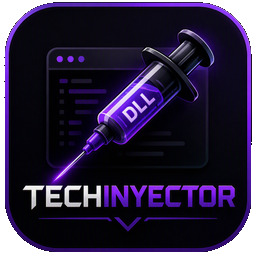
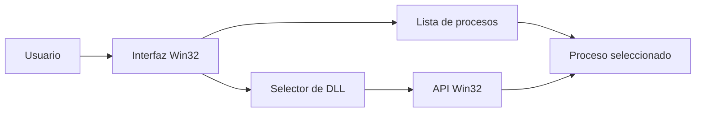

# TechInyector


Inyector de DLLs para Windows con interfaz gráfica Win32 (C++).



## ¿Qué es?

TechInyector es una pequeña herramienta que permite **inyectar un archivo `.dll` en un proceso de Windows** en ejecución, mediante la API de Windows 32 (`kernel32` + `LoadLibraryW`). Incluye una lista de procesos visibles para seleccionar el destino y un botón para buscar cualquier DLL en el disco.

## Tabla de contenidos

* [¿Qué es?](#qué-es)
* [Características](#características)
* [Instalación](#instalación)
* [Uso](#uso)
* [Requisitos para compilar](#requisitos-para-compilar)
* [Estructura](#estructura)
* [Estado de funcionalidades](#estado-de-funcionalidades)
* [Pendientes](#pendientes)
* [Arquitectura](#arquitectura)
* [Autor](#autor)
* [Contribuidores](#contribuidores)

## Características

* Tabla de procesos en ejecución con columnas (Proceso, Ejecutable, PID) que se carga automáticamente al abrir.

* Selección única de proceso a inyectar.

* Buscador de archivo `.dll` integrado (diálogo de Windows).

* Inyección manual por API Win32 (`CreateRemoteThread` + `LoadLibraryW`).

* Interfaz oscura con estilo "Gengar / liquid crystal" (púrpura elegante + violeta), sin fondos blancos.

* Ventana no redimensionable ni maximizable.

## Instalación

```bash
git clone https://github.com/Mtech208/TechInyector.git
cd TechInyector
```

## Uso

1. Abre **TechInyector.exe** (los procesos se cargan automáticamente).

2. Selecciona el proceso / aplicación al que quieres inyectar.

3. Pulsa **Browse** para elegir la DLL a inyectar (o escribe la ruta).

4. Pulsa **Inject**.

5. Usa **Refresh** para recargar la lista de procesos si es necesario.

> Esta herramienta es para **uso educativo** e investigación. Úsala solo en sistemas y procesos que te pertenezcan.

## Requisitos para compilar

* **Visual Studio Build Tools** (con la carga de trabajo "Desarrollo para escritorio con C++") o Visual Studio.

* **Windows SDK** (versión moderna, por ejemplo 10.0.26100) para compilar el recurso de icono.

* Se compila para **x64**.

### Compilar (cmd con el entorno de VS activado)

```bat
rc resources.rc

cl /nologo /EHsc TechInyector.cpp resources.res /Fe:TechInyector.exe user32.lib gdi32.lib comdlg32.lib shell32.lib advapi32.lib gdiplus.lib psapi.lib comctl32.lib
```

El `rc` debe apuntar a la versión moderna del SDK (p. ej. `....\Windows Kits\10\bin\10.0.26100.0\x64\rc.exe`) para aceptar el icono en formato PNG.

## Estructura

| Archivo                   | Descripción                                     |
| ------------------------- | ----------------------------------------------- |
| `TechInyector.cpp`        | Código fuente principal (Win32).                |
| `assets/`                 | Carpeta de recursos (iconos e imágenes).        |
| `assets/techinyector.ico` | Icono del ejecutable.                           |
| `assets/techinyector.png` | Logo / vista previa.                            |
| `assets/image.png`        | Imagen adicional mostrada en la GUI.            |
| `resources.rc`            | Definición de recursos (enlaza el icono).       |
| `compilar.bat`            | Script para compilar automáticamente.           |
| `.gitignore`              | Excluye archivos generados (binarios, objetos). |

## Estado de funcionalidades

| Función                        | Estado |
| ------------------------------ | ------ |
| Tabla de procesos en ejecución | Listo  |
| Selección de proceso           | Listo  |
| Buscador de archivos DLL       | Listo  |
| Inyección mediante API Win32   | Listo  |
| Botón Refresh                  | Listo  |
| Interfaz gráfica Win32         | Listo  |

## Pendientes

* [x] Interfaz gráfica
* [x] Lista de procesos
* [x] Selección de proceso
* [x] Selección de archivo DLL
* [x] Inyección mediante API Win32
* [ ] Mejorar la gestión de errores
* [ ] Agregar más opciones de configuración

## Arquitectura



## Autor

Creado por **Mtech08**.

## Contribuidores

* **Mtech08** — [@Mtech208](https://github.com/Mtech208)

